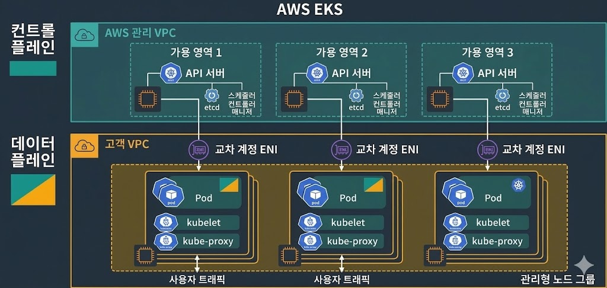

# [Study] AWS EKS vs Vanilla Kubernetes 분석 리포트

## 1. 개요 (Overview)
본 리포트는 오픈소스 **Vanilla Kubernetes**와 AWS의 관리형 서비스인 **EKS(Elastic Kubernetes Service)**의 구조적 차이점을 분석합니다. 특히 운영 효율성과 제어 권한의 경계를 'Control Plane'과 'Data Plane' 관점에서 정리하였습니다.

---

## 2. AWS EKS 아키텍처 (Architecture)
AWS EKS는 클러스터의 핵심인 **Control Plane**을 AWS가 관리하는 전용 VPC에 격리하여 운영하며, 사용자의 VPC(Data Plane)와는 **교차 계정 ENI**를 통해 통신합니다.

 
*참고: 위 이미지 경로에 저장한 아키텍처 설계도를 삽입하세요.*

---

## 3. 구조 및 운영 비교 (Managed vs Self-Managed)

| 구분 | Vanilla K8s (Self-Managed) | AWS EKS (Managed) |
| :--- | :--- | :--- |
| **Control Plane** | 사용자가 직접 설치 및 고가용성(HA) 구성 | **AWS가 완전 관리 및 3개 AZ 가용성 보장** |
| **Data Plane** | 서버 OS부터 K8s 에이전트까지 수동 관리 | 관리형 노드 그룹(MNG)으로 자동화 가능 |
| **운영 난이도** | **상** (모든 컴포넌트 장애 책임) | **중/하** (Dataplane 설정에 집중) |
| **업그레이드** | 직접 바이너리 교체 및 노드 드레인 수행 | 클릭 한 번으로 무중단 업데이트 지원 |

---

## 4. `kubectl` 리소스 가시성 차이
운영자가 `kubectl` 명령어를 사용할 때 관리 주체에 따라 보이는 리소스 범위가 다릅니다.

### 4.1 노드 조회 (`kubectl get nodes`)
- **Vanilla K8s:** Master 노드와 Worker 노드가 모두 리스트에 출력됨.
- **AWS EKS:** **Worker 노드만 출력**됨. (Master는 AWS 관리 영역이므로 숨겨짐)

### 4.2 시스템 파드 조회 (`kubectl get pods -n kube-system`)
- **Vanilla K8s:** `etcd`, `api-server`, `scheduler` 등 핵심 파드 직접 제어 가능.
- **AWS EKS:** 핵심 파드는 숨겨져 있으며, `aws-node`(CNI), `coredns` 등 **실행 환경 관련 파드만 확인** 가능.

---

## 5. 결론: "책임의 분리"
- **Vanilla K8s:** 자유도가 높으나 운영 부담이 큼 (학습 및 특수 인프라용).
- **AWS EKS:** Control Plane의 복잡성을 AWS에 위임하여 **애플리케이션 배포와 서비스 가치**에 집중 가능 (기업 운영용).

---
*제성자: [본인 이름]*
*참고 문서: [AWS EKS User Guide](https://docs.aws.amazon.com/ko_kr/eks/latest/userguide/what-is-eks.html)*